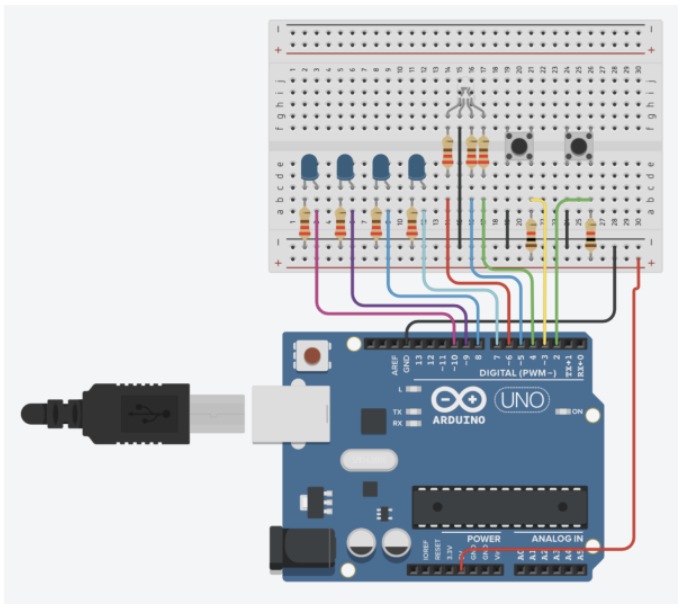
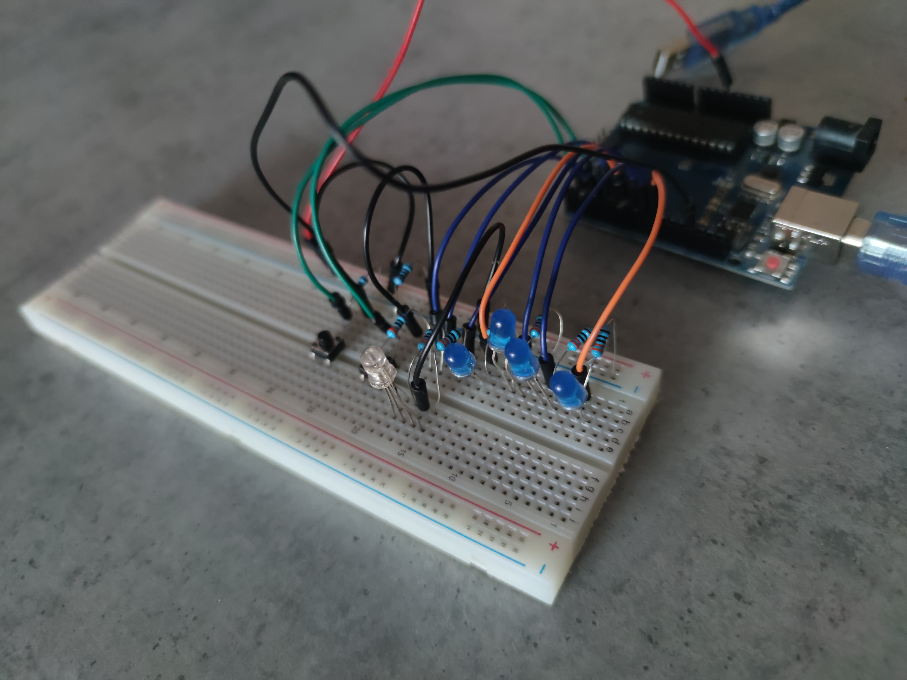
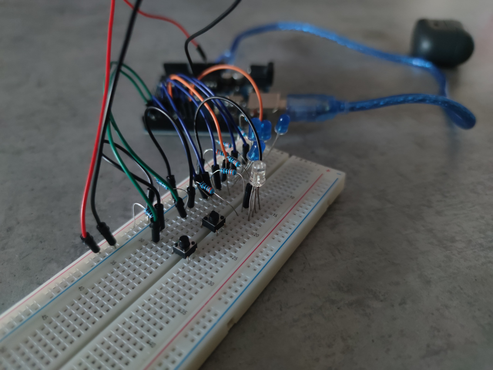
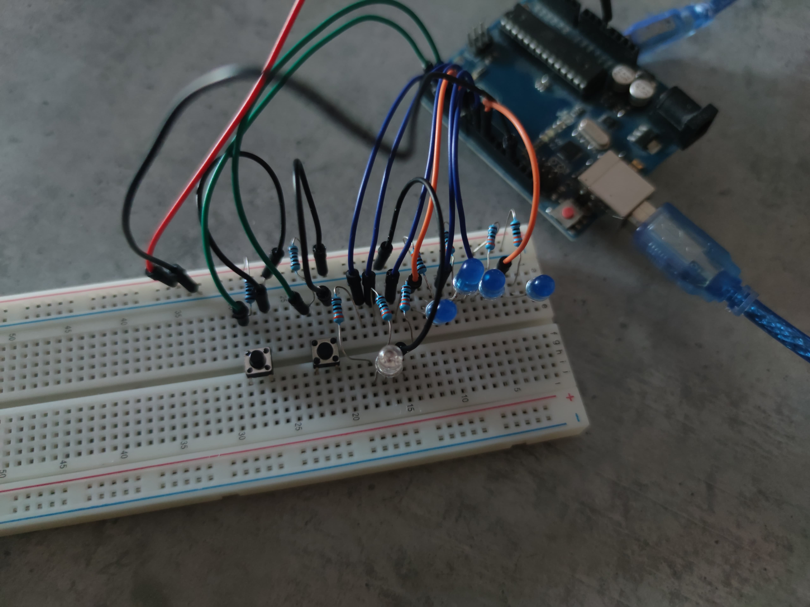
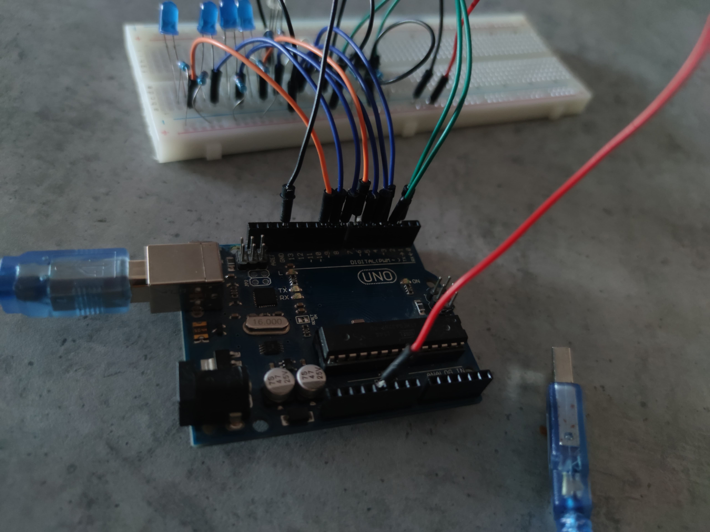

# Tema de casă 1 - ⁠Sistem de încărcare a unui vehicul electric. #

## Cerinte ##

### 1.1 Descriere ###
În această temă trebuie să simulați o stație de încărcare pentru un vehicul electric, folosind mai multe LED-uri și butoane. În cadrul acestui task trebuie să țineți cont de stările butonului și să folosiți debouncing, dar și să coordonați toate componentele ca într-un scenariu din viața reală.

### 1.2 Componente ###
- 4x LED-uri (pentru a simula procentul de încărcare)
- 1x LED RGB (pentru starea de liber sau ocupat)
- 2x Butoane (pentru start încărcare și stop încărcare)
- 8x Rezistoare (6x 220/330ohm, 2x 1K)
- Breadboard
- Linii de legătură

### Model ###

### Imagini cu circuitul realizat ###

### 1.3 Detalii tehnice ###
 Led-ul RGB reprezintă disponibilitatea stației. Dacă stația este liberă led-ul va fi verde, iar dacă stația este ocupată se va face roșu.

- Led-urile simple reprezintă gradul de încărcare al bateriei, pe care îl vom simula printr-un loader progresiv (L1 = 25%, L2 = 50%, L3 = 75%, L4 = 100%). Loader-ul se încărca prin aprinderea succesivă a led-urilor, la un interval fix de 3s. LED-ul care semnifică procentul curent de încărcare va avea starea de clipire, LED-urile din urma lui fiind aprinse continuu, iar celelalte stinse.

- Apăsarea scurtă a butonului de start va porni încărcarea. Apăsarea acestui buton în timpul încărcării nu va face nimic.

- Apăsarea lungă a butonului de stop va opri încărcarea forțat și va reseta stația la starea liberă. Apăsarea acestui buton cat timp stația este liberă nu va face nimic.

### 1.4 Flow ###
Starea stației este ‘liberă’. Loader-ul este stins, iar led-ul pentru disponibilitate este verde.

Se apasă butonul pentru start.

Led-ul pentru disponibilitate se face roșu, iar încărcarea începe prin aprinderea primului LED L1.

Led-ul 1 clipește timp de 3s, celelalte fiind stinse.

Dupa încărcarea primului procent de 25% led-ul rămâne aprins și se trece la următorul led, care va începe să clipească.

La finalizarea încărcării toate led-urile vor clipi simultan de 3 ori, iar apoi se vor stinge, pentru a semnaliza finalizarea procesului.

Led-ul pentru disponibilitate se face verde.

Dacă oricând de la pornirea încărcării până la finalizarea acesteia este apăsat lung (min 1s) butonul de stop, încărcarea se întrerupe prin animația de final (toate led-urile clipesc de 3 ori), iar led-ul pentru disponibilitate devine verde.

## Demo video cu funcționalitatea temei ##

### Start ###
<video width="600" controls>
  <source src="https://user-images.githubusercontent.com/6877923/115474571-03c75800-a23e-11eb-8096-8973aad5fa9f.mp4" type="video/mp4">
  Your browser does not support the video tag.
</video>

### Stop ###

[Watch Tema1Stop Video](video/Tema1Stop.mp4)
