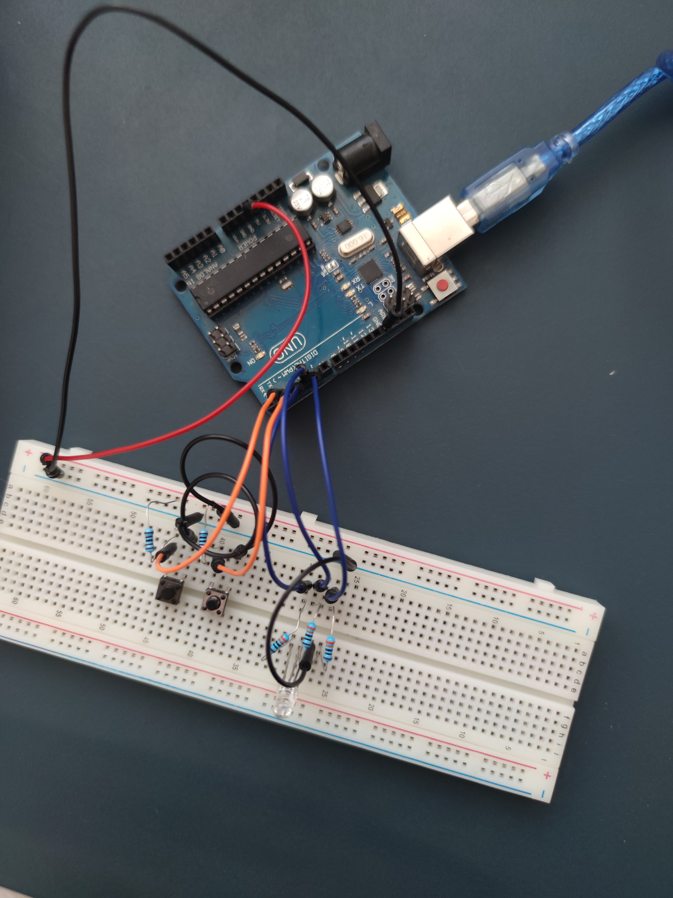
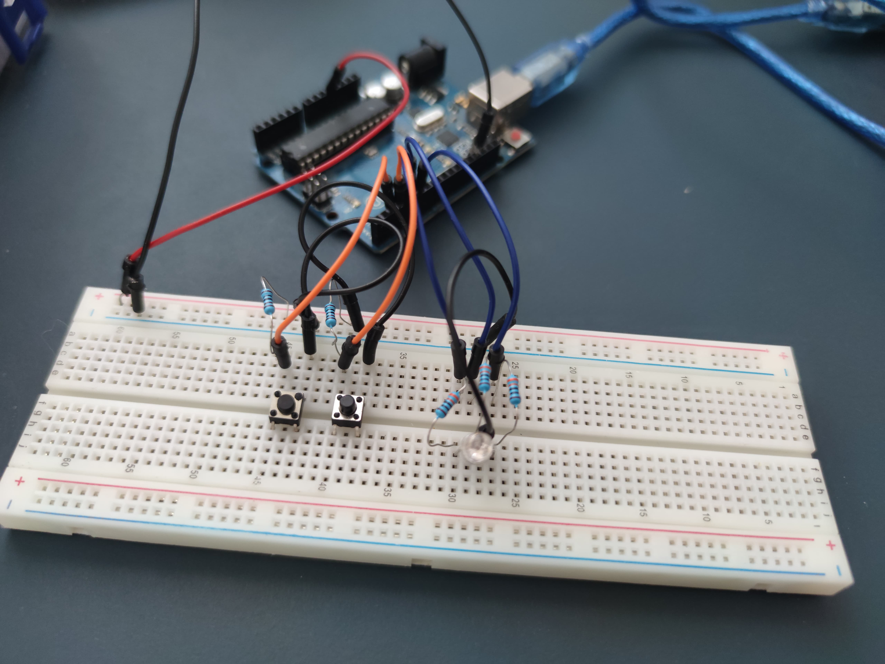
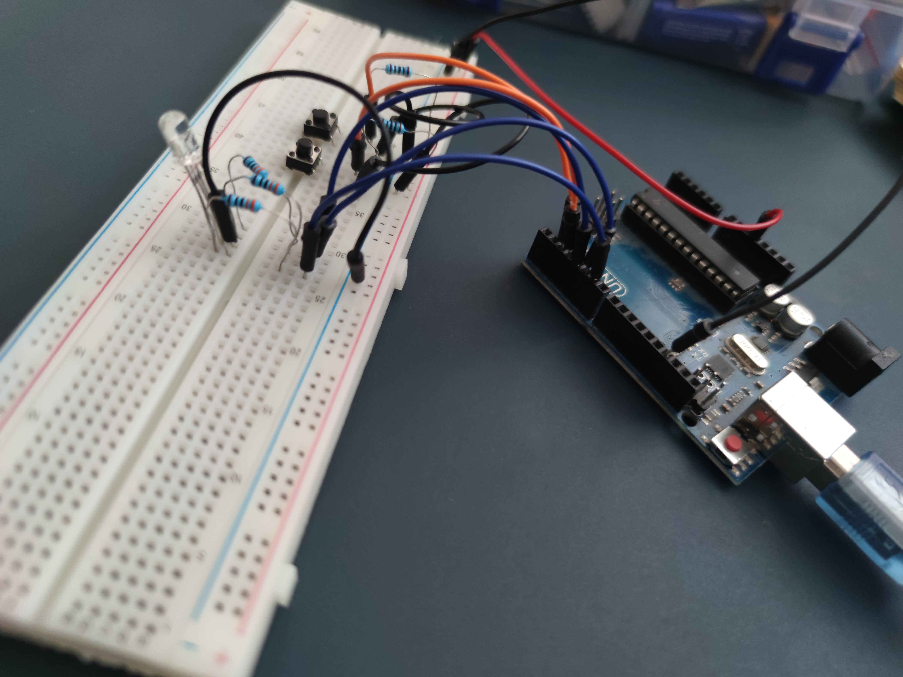

# Homework 2 - TypeRacer Game

## Requirements

### 2.1 Description
In this assignment, you will create a game similar to TypeRacer.

### 2.2 Components
- **Arduino UNO** (ATmega328P microcontroller)
- **1x RGB LED** (to indicate the game status)
- **2x Buttons** (for starting/stopping a round and selecting difficulty)
- **5x Resistors** (to control the current for the buttons and LED)
- **Breadboard** (for connecting components)
- **Jumper Wires** (for wiring)

### 2.3 Technical Details

#### RGB LED - Status Indicator:
- **Idle State**: The LED will be white.
- **Start Countdown**: When the start button is pressed, the LED will blink for 3 seconds, indicating a countdown before the round begins.
- **During Round**: The LED will be green if the typed text is correct and will turn red if there’s a mistake.

#### Start/Stop Button:
- **Idle Mode**: If the game is stopped, pressing the button initiates a new round after a 3-second countdown.
- **During Round**: If a round is active, pressing the button will immediately stop it.

#### Difficulty Button:
- Controls the speed at which words appear and can only be used in idle mode.
- Each press cycles through difficulties: (Easy, Medium, Hard).
- On changing difficulty, a message is sent via serial: “Easy/Medium/Hard mode on!”

#### Word Generation:
- A dictionary of words will be created.
- During a round, words are displayed in the terminal in random order.
- If the current word is typed correctly, a new word will appear immediately. If not, a new word will appear after a delay based on the selected difficulty.

#### Other Notes:
- Each round lasts 30 seconds.
- At the end of each round, the terminal will display the total number of correctly typed words.

### 2.4 Game Flow
1. The game is in idle mode, and the RGB LED is white.
2. The difficulty level is selected using the difficulty button, and the terminal displays “Easy/Medium/Hard mode on!”.
3. Press the start/stop button.
4. The LED blinks for 3 seconds, and the terminal shows the countdown: 3, 2, 1.
5. The LED turns green, and words start appearing to be typed.
6. For correct typing, the next word appears immediately. If the word is not typed within the time limit for the difficulty, a new word appears.
7. An error turns the LED red. Use the BackSpace key to correct the word.
8. After 30 seconds, the round ends, and the terminal displays the score: the total number of correctly typed words.
9. The game can be stopped anytime using the start/stop button.

# Model
## Tinkercad

## [Tinkercad link](https://www.tinkercad.com/things/ejPXIBgKgnp-typeracer?sharecode=EwFlwbNyuTstc3OYzn3IYzzZg6adNmzivf2CG5wIEJo)

## Physical

### Images






### Video of functionality 


# Code Explanation

### Global Variables

- `redPin`, `greenPin`, `bluePin`: Pins for the RGB LED.
- `startStopButtonPin`, `difficultyButtonPin`: Pins for the buttons.
- `gameRunning`, `buttonPressed`, `difficultyButtonPressed`: State variables for the game and buttons.
- `roundStartTime`, `currentWordTime`: Timing variables.
- `correctWordsCount`: Counter for correct words.
- `roundDuration`: Duration of a round (30 seconds).
- `lastDifficultyChangeTime`, `debounceInterval`: Variables for debouncing.
- `currentDifficulty`, `wordDisplayInterval`: Variables for difficulty levels.
- `words[]`: Array of words for the game.
- `wordsCount`: Number of words in the array.
- `currentWord`, `inputWord`: Variables for the current word and user input.

### Functions

- `setLEDColor(int red, int green, int blue)`: Sets the color of the RGB LED.
- `getRandomWord()`: Returns a random word from the `words` array.
- `startRound()`: Starts a new round.
- `stopRound()`: Stops the current round.
- `changeDifficulty()`: Changes the difficulty level.
- `isWordCorrect(const String& inputWord)`: Checks if the input word is correct.
- `startStopISR()`: Interrupt Service Routine for the Start/Stop button.
- `difficultyISR()`: Interrupt Service Routine for the Difficulty button.

### Setup

The `setup()` function initializes the pins, the serial monitor, and attaches interrupts to the buttons.

### Loop

The `loop()` function handles the game logic:
- Checks the state of the Start/Stop button.
- Checks the state of the Difficulty button.
- Manages the game timing and word display.
- Reads user input and checks if the word is correct.

## Code

```cpp
#include <Arduino.h>

// LED RGB pins
const int redPin = 6;
const int greenPin = 5;
const int bluePin = 4;

// Button pins
const int startStopButtonPin = 2;
const int difficultyButtonPin = 3;

// Game state variables
volatile bool gameRunning = false;
volatile bool buttonPressed = false;
volatile bool difficultyButtonPressed = false;
unsigned long roundStartTime = 0;
unsigned long currentWordTime = 0;
int correctWordsCount = 0;
const int roundDuration = 30000;
const int zero = 0;

// Debouncing and difficulty change
unsigned long lastDifficultyChangeTime = 0;
const unsigned long debounceInterval = 300;

// Difficulty levels
enum Difficulty { EASY, MEDIUM, HARD };
Difficulty currentDifficulty = MEDIUM;
unsigned long wordDisplayInterval = 4000;

// Word dictionary
const char* words[] = {
  "arduino", "robot", "code", "led", "sensor", "button", "computer", "programming", "microcontroller", "display",
  "keyboard", "mouse", "monitor", "circuit", "resistor", "capacitor", "transistor", "breadboard", "voltage", "current",
  "resistance", "power", "frequency", "oscillator", "amplifier", "diode", "inductor", "relay", "switch", "battery"
};
const int wordsCount = sizeof(words) / sizeof(words[0]);
String currentWord = "";
bool newWordGenerated = false;
String inputWord = "";

// LED RGB functions
void setLEDColor(int red, int green, int blue) {
  analogWrite(redPin, red);
  analogWrite(greenPin, green);
  analogWrite(bluePin, blue);
}

// Get a random word
String getRandomWord() {
  return words[random(0, wordsCount)];
}

// Start a new round
void startRound() {
  gameRunning = true;
  roundStartTime = millis();
  correctWordsCount = 0;
  newWordGenerated = false;

  switch (currentDifficulty) {
    case EASY:
      wordDisplayInterval = 6000;
      break;
    case MEDIUM:
      wordDisplayInterval = 4000;
      break;
    case HARD:
      wordDisplayInterval = 2000;
      break;
  }

  for (int i = 3; i > 0; i--) {
    setLEDColor(255, 255, 255);
    delay(500);
    setLEDColor(0, 0, 0);
    delay(500);
    Serial.println(i);
  }

  Serial.println("The round has started!");
  setLEDColor(0, 255, 0);
  
  currentWord = getRandomWord();
  Serial.print("Word: ");
  Serial.println(currentWord);
  currentWordTime = millis();
  newWordGenerated = true;
}

// Stop the round
void stopRound() {
  gameRunning = false;
  setLEDColor(255, 255, 255);
  Serial.print("\nThe round has ended! Correct words: ");
  Serial.println(correctWordsCount);
}

// Change difficulty
void changeDifficulty() {
  if (gameRunning) return;

  currentDifficulty = static_cast<Difficulty>((currentDifficulty + 1) % 3);

  switch (currentDifficulty) {
    case EASY:
      wordDisplayInterval = 6000;
      Serial.println("Easy mode on!");
      break;
    case MEDIUM:
      wordDisplayInterval = 4000;
      Serial.println("Medium mode on!");
      break;
    case HARD:
      wordDisplayInterval = 2000;
      Serial.println("Hard mode on!");
      break;
  }
}

// Check if the input word is correct
bool isWordCorrect(const String& inputWord) {
  return inputWord.equals(currentWord);
}

// ISR for Start/Stop button
void startStopISR() {
  if (millis() - lastDifficultyChangeTime > debounceInterval) {
    buttonPressed = true;
    lastDifficultyChangeTime = millis();
  }
}

// ISR for Difficulty button
void difficultyISR() {
  if (millis() - lastDifficultyChangeTime > debounceInterval) {
    difficultyButtonPressed = true;
    lastDifficultyChangeTime = millis();
  }
}

void setup() {
  pinMode(redPin, OUTPUT);
  pinMode(greenPin, OUTPUT);
  pinMode(bluePin, OUTPUT);

  pinMode(startStopButtonPin, INPUT_PULLUP);
  pinMode(difficultyButtonPin, INPUT_PULLUP);

  Serial.begin(9600);

  setLEDColor(255, 255, 255);
  
  Serial.print("\nWelcome to the Typing Game! Press the Start/Stop button to begin.\n");

  // Attach interrupts
  attachInterrupt(digitalPinToInterrupt(startStopButtonPin), startStopISR, FALLING);
  attachInterrupt(digitalPinToInterrupt(difficultyButtonPin), difficultyISR, FALLING);
}

void loop() {
  if (buttonPressed) {
    buttonPressed = false;
    if (!gameRunning) {
      startRound();
    } else {
      stopRound();
    }
  }

  if (difficultyButtonPressed) {
    difficultyButtonPressed = false;
    changeDifficulty();
  }

  if (gameRunning) {
    if ((millis() - roundStartTime) > roundDuration) {
      stopRound();
    } else {
      if (millis() - currentWordTime > wordDisplayInterval) {
        currentWord = getRandomWord();
        Serial.print("\nWord: ");
        Serial.println(currentWord);
        currentWordTime = millis();
        setLEDColor(0, 255, 0);
        inputWord = "";
      }

      while (Serial.available() > zero) {
        char c = Serial.read();
        if (c == '\b') {
          if (inputWord.length() > zero) {
            inputWord.remove(inputWord.length() - 1);
            Serial.print("\b \b");
          }
        } else if (c != '\r' && c != '\n') {
          inputWord += c;
          Serial.print(c);

          if ((inputWord.length() <= currentWord.length() && inputWord != currentWord.substring(0, inputWord.length())) || inputWord.length() > currentWord.length()) {
            setLEDColor(255, 0, 0);
          } else {
            setLEDColor(0, 255, 0);
          }

          if (isWordCorrect(inputWord)) {
            correctWordsCount++;
            Serial.println("\nCorrect Word!");
            setLEDColor(0, 255, 0);
            
            currentWord = getRandomWord();
            Serial.print("\nWord: ");
            Serial.println(currentWord);
            currentWordTime = millis();
            inputWord = "";
          }
        }
      }
    }
  }
}
