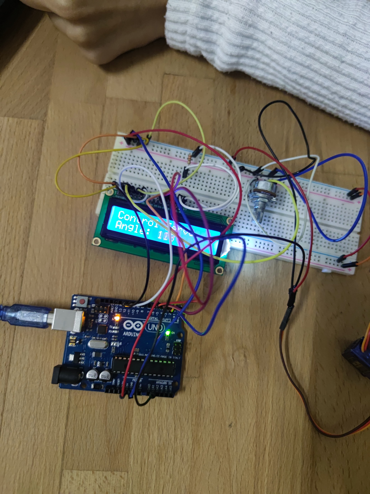
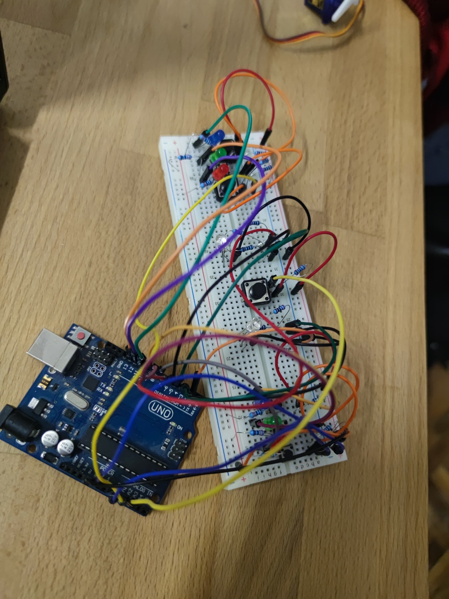
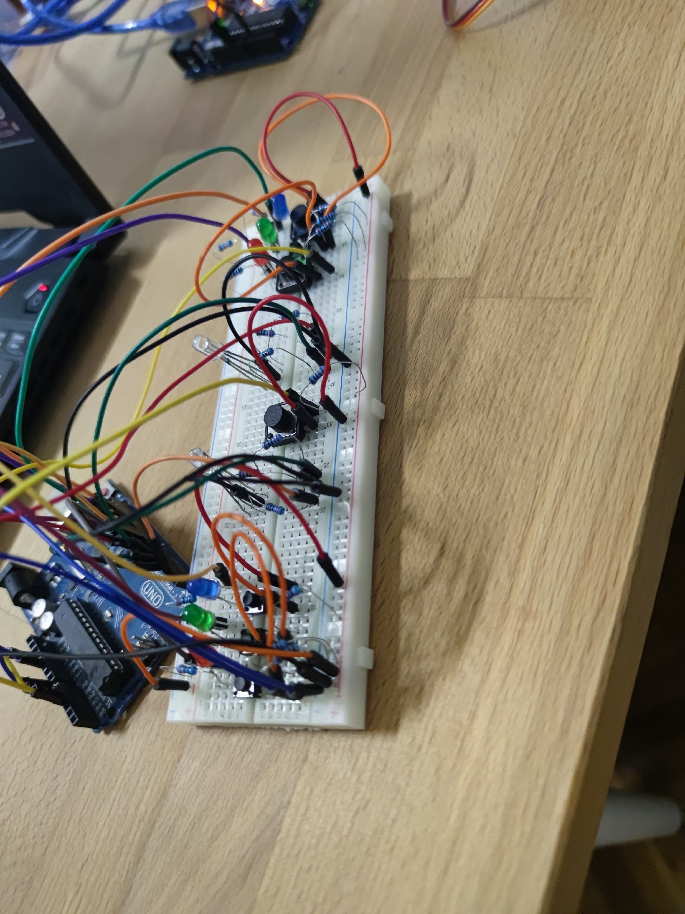
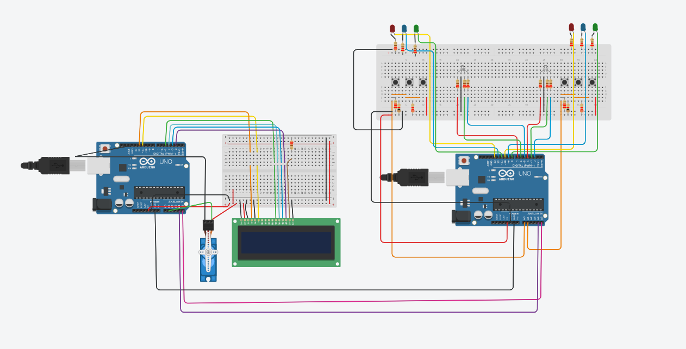

# Reflex Game for Two Players

## Task Description
This project involves creating a competitive reflex game for two players, testing their reaction speeds across multiple rounds. Each player has their own buttons and LEDs, and the goal is to press the button matching the color displayed on their RGB LED as quickly as possible. Scores are displayed on an LCD screen and updated throughout the game. At the end, the player with the highest score is declared the winner.

## Components Used
- **6x LEDs**: Two groups of 3 LEDs each, with different colors in each group.
- **2x RGB LEDs**: One for each player.
- **6x Buttons**: Three for each player.
- **1x LCD Screen**
- **1x Servomotor**
- **2x Breadboards**
- **Connecting Wires**
- **2x Arduino Uno Boards**

## Functionality
### Initialization
- The game starts with a welcome message displayed on the LCD.
- A button press starts the game. Options for the start button:
  - Any button starts the game.
  - A specific button designated as the start button.
  - A dedicated 7th button for starting the game.

### Game Rounds
- Each player has three buttons corresponding to three LED colors and one RGB LED.
- During a round:
  - The active player's RGB LED lights up in a color.
  - The player must press the button matching the color as quickly as possible to earn points. Faster responses yield more points.
  - Scores are updated on the LCD after each round.

### Game Timer
- A servomotor rotates during the game to indicate progress. A full rotation marks the end of the game.
- At the end:
  - The LCD displays the winner's name and final score for a few seconds before resetting to the welcome screen.

### Bonus Features
- Optional features:
  - Animations on the LCD or LEDs.
  - A buzzer for feedback and sound effects.
  - Player name input via buttons, joystick, or USART.

## Technical Details
### Communication
- Two Arduino Uno boards are used:
  - **Master Arduino**: Manages the LCD, servomotor, and game state (scores, active LEDs, etc.).
  - **Slave Arduino**: Handles buttons and LEDs, receiving instructions from the master and sending back button press data via SPI.

### Buttons
- Options for the start button include:
  - Any button.
  - A specific button marked on the breadboard.
  - A dedicated 7th button.
- During gameplay:
  - Buttons are used exclusively for game control.
  - Only the active player's buttons can control the game.
- Button multiplexing with resistors may be required due to limited GPIO pins.

### LEDs
- Each button corresponds to an LED of a specific color.
- RGB LEDs:
  - Light up in one of three colors corresponding to the buttons.
  - Remain off when it is not the player's turn.

### LCD
- Controlled using the `LiquidCrystal` library.
- Displays both players' scores throughout the game.
- Uses pins D4-D7 for data lines.

### Servomotor
- Starts at 0 degrees and rotates counterclockwise to indicate time progression.
- Use absolute rotation commands with the `Servo.h` library.

## Bonus
- Up to 1 extra point for features such as:
  - LED or LCD animations.
  - A buzzer for signaling events.
  - Allowing players to input their names via buttons, joystick, or USART.

## Notes
- Divide the code into multiple files (`.h/.hpp` and `.c/.cpp`) for better team collaboration.
- Pins A0-A6 can also be used as digital pins if necessary, even after button multiplexing.

# Code

# Arduino Game with RGB LEDs and Servo Control

## Overview
This project is composed of two main parts:
1. A reaction time game with two players using RGB LEDs and analog sensors (A0, A1) to detect colors.
2. A servo control system that moves a servo motor and displays the movement on an LCD screen.

The game involves two players pressing a button to react to color changes on the RGB LEDs, while the servo motor is controlled and displayed on an LCD screen.

## Components Used
- **RGB LEDs** (connected to pins A0, A1 for Player 1 and Player 2)
- **Analog sensors** (A0, A1) for detecting color inputs
- **Servo motor** (connected to pin 10)
- **LCD Display** (connected to pins 2, 3, 4, 5, 11, and 12)
- **Start Button** (connected to pin A2)

## Game Logic
- Each player has an RGB LED and an analog color sensor.
- The game starts by pressing the start button. The LED on each player's side changes to a random color.
- Players have to react quickly by pressing the correct color sensor when the LED matches their color.
- The time taken to react is recorded, and points are awarded based on the reaction time.
- The game continues for 3 rounds, and the player with the highest score at the end wins.
- The total score is displayed in the serial monitor, and the round details are logged.

## Servo Control
- A servo motor is used to demonstrate simple movement controlled by the Arduino.
- The servo moves from 0 to 180 degrees and back to 0, with the angle being displayed on an LCD screen.
- The movement of the servo is accompanied by graphical animations on the LCD.

## Code Explanation

### Game Setup
- The pins for the RGB LEDs are defined for both Player 1 and Player 2 (A0, A1).
- The game is initiated by pressing the start button (A2).
- The game checks the analog inputs from the sensors (A0 and A1) to detect colors and check the player's reaction time.
- The reaction time is compared to predefined thresholds, and points are awarded accordingly.

### Servo Control Setup
- The servo motor is controlled with pin 10 and is moved from 0 to 180 degrees.
- The LCD screen displays a graphical animation as the servo moves.

### Functions
- **`turnOffAllLEDs()`**: Turns off all LEDs.
- **`setRandomColor_A0()`**: Sets a random color on Player 1's RGB LED.
- **`setRandomColor_A1()`**: Sets a random color on Player 2's RGB LED.
- **`checkStartButtonPress()`**: Detects when the start button is pressed.
- **`calculatePoints()`**: Calculates points based on reaction time.
- **`checkButtonAndSetLED_A0()`**: Checks if Player 1 pressed the correct button for the current color.
- **`checkButtonAndSetLED_A1()`**: Checks if Player 2 pressed the correct button for the current color.

### Servo Motor Control
- **`myservo.write()`**: Controls the angle of the servo motor.
- **LCD Animations**: Several animations are created using the `lcd_1.setCursor()` and `lcd_1.write()` functions to display a visual representation of the servo control.

### Main Loop
- The main loop continuously checks the game status and updates the display.
- The game runs for a set duration, and the scores are reset after each round.

## Wiring Diagram
- **RGB LEDs**: Connected to the specified pins for both Player 1 and Player 2.
- **Analog Sensors**: Connected to analog inputs A0 and A1 to detect color.
- **Start Button**: Connected to pin A2 with a pull-up resistor.
- **Servo Motor**: Connected to pin 10.
- **LCD**: Connected to pins 2, 3, 4, 5, 11, and 12 for display control.

## Usage
1. Connect all components as per the wiring diagram.
2. Upload the code to your Arduino.
3. Press the start button to begin the game.
4. React to the color changes by pressing the correct button corresponding to the LED color.
5. Watch the servo move while the LCD displays the angle and animation.
6. Check the serial monitor for scores at the end of each round.

## Notes
- This code assumes that the start button is connected to pin A2 and is pulled HIGH by default (input_pullup).
- The reaction time thresholds are set to different levels, awarding higher points for faster responses.

## Credits
This project was developed using Arduino, LiquidCrystal, and Servo libraries.
 
# Images

# Videos

https://github.com/user-attachments/assets/66cd9977-3414-4f3b-a57a-d5a304215ba8
https://github.com/user-attachments/assets/5cbd6854-b991-43aa-813a-ea5a37bab8b4

